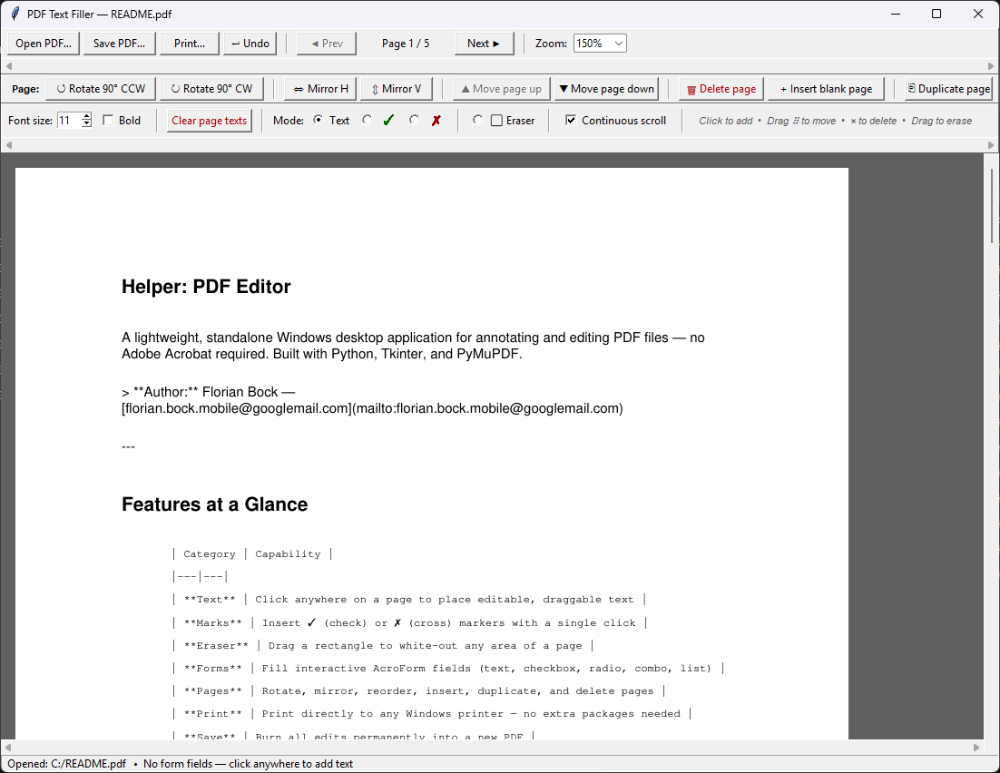
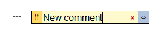
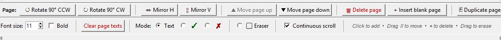

# Helper: PDF Editor

A lightweight, standalone Windows desktop application for annotating and editing PDF files — no Adobe Acrobat required. Built with Python, Tkinter, and PyMuPDF.

> **Author:** Florian Bock — [florian.bock.mobile@googlemail.com](mailto:florian.bock.mobile@googlemail.com)

---

## Features at a Glance

| Category | Capability |
|---|---|
| **Text** | Click anywhere on a page to place editable, draggable text |
| **Marks** | Insert ✓ (check) or ✗ (cross) markers with a single click |
| **Eraser** | Drag a rectangle to white-out any area of a page |
| **Forms** | Fill interactive AcroForm fields (text, checkbox, radio, combo, list) |
| **Pages** | Rotate, mirror, reorder, insert, duplicate, and delete pages |
| **Print** | Print directly to any Windows printer — no extra packages needed |
| **Save** | Burn all edits permanently into a new PDF |
| **Undo** | Ctrl+Z to undo the last placement or eraser |
| **View** | Continuous-scroll or single-page view, zoom 50 % – 300 % |
| **Portable** | Build as a single `.exe` with PyInstaller, supports drag-and-drop |
| **About** | Version, build date, GitHub link, and author info via the About dialog |

---

## Screenshots

> *No screenshots are included yet — add images to a `docs/` folder and update the paths below.*

| Main window | Placing text | Page operations |
|---|---|---|
|  |  |  |

---

## Getting Started

### Prerequisites

- Python 3.10 or later (Windows)
- The two required packages:

```
pip install PyMuPDF Pillow
```

### Run from source

```powershell
python helper_pdf-editor.py
```

You can also drag a PDF file onto the script (or the built `.exe`) to open it immediately.

### Build a standalone executable

A PowerShell build script is included. It creates a virtual environment, installs all dependencies, and produces a single-file Windows executable using PyInstaller:

```powershell
.\build.ps1
```

The resulting file is placed at `helper_pdf-editor.exe` in the project root and requires no Python installation to run.

---

## Usage

### Opening a PDF

Click **Open PDF…** in the toolbar or drag-and-drop a PDF file onto the window (or the `.exe`).

### Placing text

1. Make sure **Text** mode is selected in the editing toolbar.
2. Adjust **Font size** and toggle **Bold** as needed.
3. Click anywhere on the page — an editable text field appears at that position.
4. Type your text. The field expands automatically to fit.

Once placed, every text item has three handles:

| Handle | Action |
|---|---|
| **×** (red) | Delete this text item |
| **⣿** (yellow grip) | Drag to reposition |
| **⇔** (blue grip) | Drag to resize the field width |

### Placing check / cross marks

Select **✓** or **✗** from the **Mode** selector, then click the desired position. The mark is rendered in green (✓) or red (✗) and burned geometrically into the PDF on save.

### Erasing content

1. Select **⬜ Eraser** mode.
2. Drag a rectangle over the content you want to remove.
3. A white preview box appears immediately. On save, a white-filled rectangle is written over that area, hiding the original content.

### Filling AcroForm fields

When a PDF contains interactive form fields, the app overlays editable widgets (text boxes, checkboxes, dropdowns …) directly on top of them. Fill them in and save — the values are written back into the PDF.

### Zoom and scroll

- Use the **Zoom** drop-down (50 % – 300 %) to adjust the view.
- Toggle **Continuous scroll** to see all pages stacked vertically in a single scrollable canvas.
- Mouse wheel scrolls the page. In continuous-scroll mode the current page indicator tracks which page is in view.

### Page operations (second toolbar row)

| Button | Action |
|---|---|
| ↺ Rotate 90° CCW / ↻ Rotate 90° CW | Rotate the current page |
| ⇔ Mirror H / ⇕ Mirror V | Flip the page horizontally or vertically |
| ▲ Move page up / ▼ Move page down | Reorder pages |
| 🗑 Delete page | Remove the current page (with confirmation) |
| + Insert blank page | Add a blank page after the current one |
| ⎘ Duplicate page | Copy the current page and insert it after itself |

### Printing

Click **Print…** to open the print dialog. Choose a printer, set the page range (all / current / custom e.g. `1-3, 5`), and the number of copies. Printing uses the Windows GDI32 API via `ctypes` — no third-party print library is required.

### Saving

Click **Save PDF…** to choose an output path. All placed text, check/cross marks, and eraser rectangles are burned permanently into the new file. The original PDF is never modified.

### About

Click **About** in the toolbar to open the About dialog. It shows:

- **Version number** and **build date/time** (the build date is stamped at compile time by `build.ps1`; when running from source it shows "running from source")
- Clickable **GitHub repository** link — opens your default browser
- **Author name** and **email** (the email is a `mailto:` link)

### Undo

Press **Ctrl+Z** or click **↩ Undo** to remove the most recently placed text, mark, or eraser rectangle.

---

## Keyboard Shortcuts

| Shortcut | Action |
|---|---|
| `Ctrl+Z` | Undo last placement / eraser |

---

## Dependencies

| Package | Version | Purpose |
|---|---|---|
| [PyMuPDF](https://pymupdf.readthedocs.io/) | ≥ 1.23.0 | PDF rendering, reading, and writing |
| [Pillow](https://pillow.readthedocs.io/) | ≥ 10.0.0 | Image conversion for canvas display |

All other functionality (GUI, printing, font lookup) uses the Python standard library and Windows built-in APIs (`ctypes`, `tkinter`, `GDI32`, `winspool`).

---

## Project Structure

```
helper_pdf-editor.py      # Main application (single file)
requirements.txt          # pip dependencies
build.ps1                 # PowerShell script to build helper_pdf-editor.exe
helper_pdf-editor.spec    # PyInstaller spec (generated by build.ps1)
build/                    # PyInstaller build artefacts
```

---

## License

See [LICENSE](LICENSE) for details.

---

## Contributing

Issues and pull requests are welcome. Please open an issue first to discuss any larger changes.
